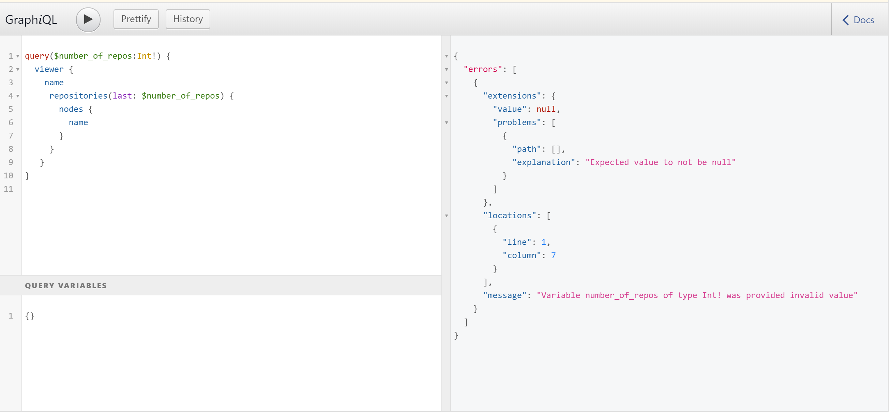
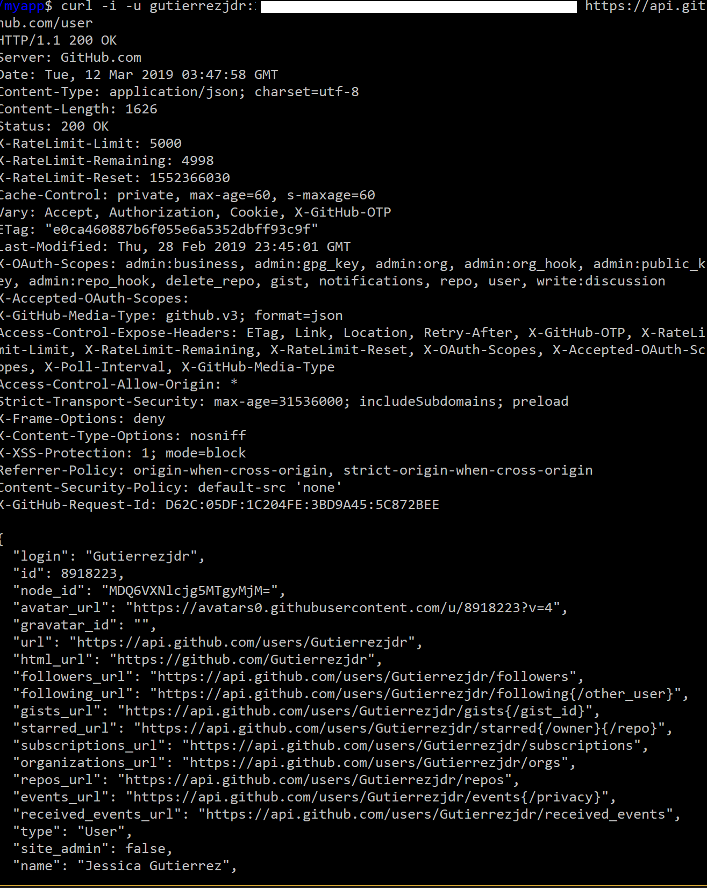

### OpenSource-NY Update

I worked on the "Making requests through curl with the github REST API." item. I am trying to understand Github's API V4 but it now uses GraphQL.

THe syntax does confuse me so I did a few practice examples but I believe I will have to do more readings. 
I also set up my authorization token  as a developer and did my first curl call which came back as a 200 response showing that all is well.

I will continue reading documentaiton and doing more practice examples on GraphQl. 

### Update Part 2

This week we determined what needed to be done first which was a login page that asks GitHub for access to that users account. The reason for this was because I wanted to be able to obtain information from the user and call the github api through Express. I opened the [issue](https://github.com/opensource-ny/OpenSource-NY/issues/36) up to start the process for it. I tried to solve this isssue with a [pull request](https://github.com/opensource-ny/OpenSource-NY/pull/37) that added a basic HTML form box and changed the port number
in our express javascript file to 3000. I made usre to ask yizong to review my pull request as I was not sure if I was taking the right steps.  

After discussing wiht my teammates through slack we came to a conclusion. I had misunderstood how React and Express work together as my teammates pointed out that setting the port to 3000 would conflict with our react javascript file. Therefore, I rejected my own pull request. This showed me that I needed more information and education on how react and express work together. For now I am just working on understanding their collaboration before I continue to add code. I want to learn this first before working on my items because I should lnow exactly how the app and its files will communicated with each other which will make passing information later on much easier as well. 

### Patrick Masson's Talk
Patricks Masson's  talk  was extremely interesting. The most important things I learned were how to tell apart between companies
that actually support Open Source to those that play a facade for Open Source. The terms "fopensource" and "Open Washing" where also 
good to know as they are characteristics that we need to look for. The information presented on the percentages of open source software used in companies showed me how important open source is in the industry so far. I didn't know it was so prevalent and it actually encourages me to do more open source and work harder since I can do something I enjoy and get paid for it.   
I think it was also very useful that Patrick even showed job postings for Open Source. It shows that there are definitely demands for this skill. It was a bit disappointing though to see that most of these job postings need a lot of experience that most students might not have. 
I hope to continue this hobby of contributing to open source as a way to gain skills and feedback on my work. I do feel like I never recieved proper feedback on code during my time in school so I wish to gain mentorships in these communities. I also hope to start projects that are open source and hope to use the OpenSource-NY as a glimpse to what challenges a new project will face. 
